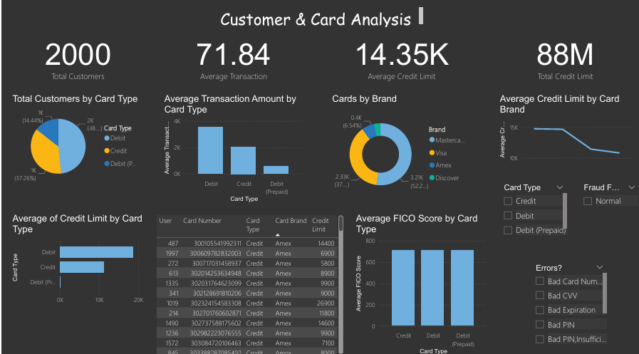
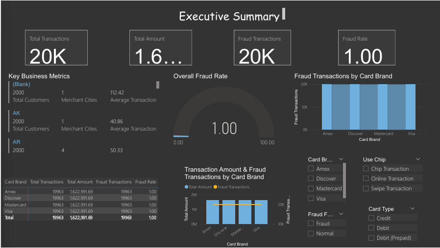

# 📊 Fraud Detection Analysis using Power BI

Interactive Power BI dashboard for fraud detection analysis using Business Intelligence.

---
<p align="center">


</p>
# 🚀 Tools & Technologies

- 📊 Microsoft Power BI
- 📈 DAX
- 🔄 Power Query
- 📂 Excel
- 📉 Data Visualization

---

# 🎯 Project Objectives

- Detect fraudulent transactions
- Analyze customer behavior
- Analyze merchant performance
- Identify fraud trends
- Build an interactive dashboard

---

# 📌 Dashboard Preview

## 1️⃣ Fraud Overview


---

## 2️⃣ Customer & Card Analysis



---

## 3️⃣ Merchant Analysis


---

## 4️⃣ Transaction Trend Analysis


---

## 5️⃣ Geographical Analysis


---

## 6️⃣ Error & Fraud Pattern Analysis


---

## 7️⃣ Executive Summary



---

# 📈 Key Performance Indicators (KPIs)

| KPI | Value |
|------|-------|
| Total Transactions | 20K |
| Total Customers | 2K |
| Total Amount | 1.62M |
| Merchant Cities | 295 |
| Merchant States | 41 |
| Fraud Detection | Interactive Dashboard |

---

# 📂 Repository Structure

```text
Fraud-Detection-Analysis-PowerBI
│
├── Fraud_Detection.pbix.zip
├── README.md
└── assets
    └── assets
        ├── Fraud Overview.png
        ├── customer_analysis.png
        ├── Mercant Analysis.png
        ├── Transaction Analysis.png
        ├── Geographical Analysis.png
        ├── Error Analysis.png
        └── executive_summary.png
```

---

# 💡 Key Features

- Interactive dashboard
- Fraud trend analysis
- Customer insights
- Merchant insights
- Geographic analysis
- Executive summary
- KPI monitoring

---

# 👩‍💻 Author

**Mrudhula Kimidi**

B.Tech – Computer Science & Engineering

Power BI | Data Analytics | Business Intelligence
